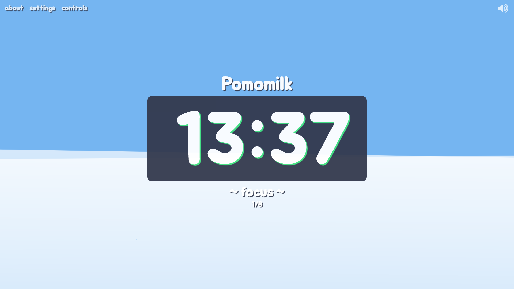
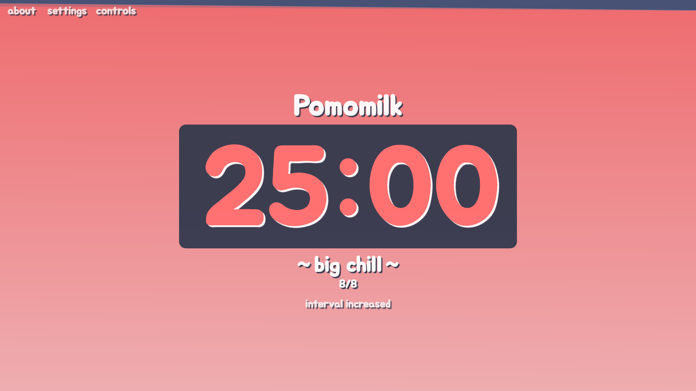
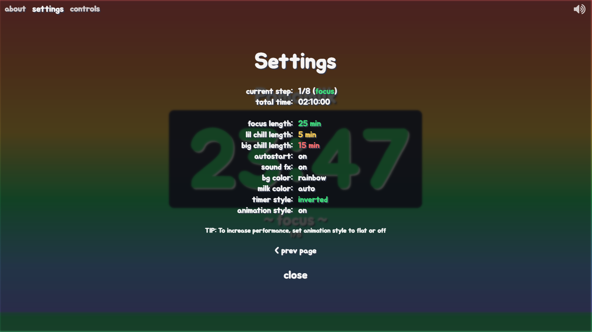
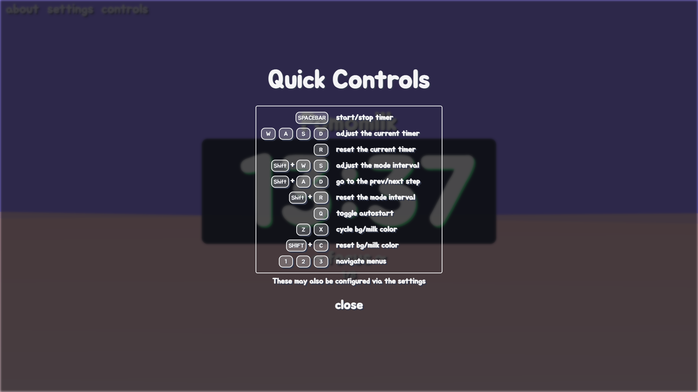

<!-- TITLE -->
<div align="center">

<p>
<h1>Pomomilk</h1>
<p>A simple interactive pomodoro timer
</p>

<p>Built with <a href="https://reactjs.org/">React</a> + <a href="https://redux.js.org/">Redux</a>, CSS</a>/<a href="https://sass-lang.com/">Sass</a>, and hosted with <a href="https://www.netlify.com/">Netlify</a></p>

<b><a href="http://pomomilk.com/" target="_blank">
   » View Live Site «
</a></b>


</div>

<!-- INTRODUCTION -->

## 📚 Introduction

<b>[Pomomilk](http://pomomilk.com/)</b> is a responsive, single-page interactive pomodoro timer. Users can easily control and configure the auto-cycling timer. The large, customizable display is filled with milk to visualize focus time progression, then similarly drained during breaks.

> The [Pomodoro Technique](https://en.wikipedia.org/wiki/Pomodoro_Technique) is a time management method that involves breaking down work into intervals called "pomodoros" (typically 25 min). These are separated by short breaks (3-5 min), with every fourth being a longer break (15-30min).

<!-- FEATURES -->

## ⭐ Features
- Users can control the timer via quick control hotkeys or the Settings menu.
- Users can customize interval lengths.
- Users can adjust the timer, skip, or reset the current step.
- Users can toggle timer autostart.
- Time progression is visualized by milk that dynamically fills up the screen.
- Users can customize the background/milk colors and timer style.
- Users can set milk color to "auto" to have it change according to the current step.
- Users can set milk color to "off" to disable the time visualization.

<!-- INSTALLATION -->

## 🛠 Installation

The project is live
<b><a href="http://pomomilk.com/" target="_blank">here</a></b>, but if you would prefer a local installation:

1. Clone or download this repository
   ```
   git clone https://github.com/ahhreggi/pomomilk
   ```
2. Navigate to the project directory and install dependencies
   ```
   cd pomomilk
   npm install
   ```
3. Launch the development web server
   ```
   npm start
   ```
4. Visit <a href="http://localhost:3000/">http://localhost:3000/</a> on your browser

## 📷 Screenshots




